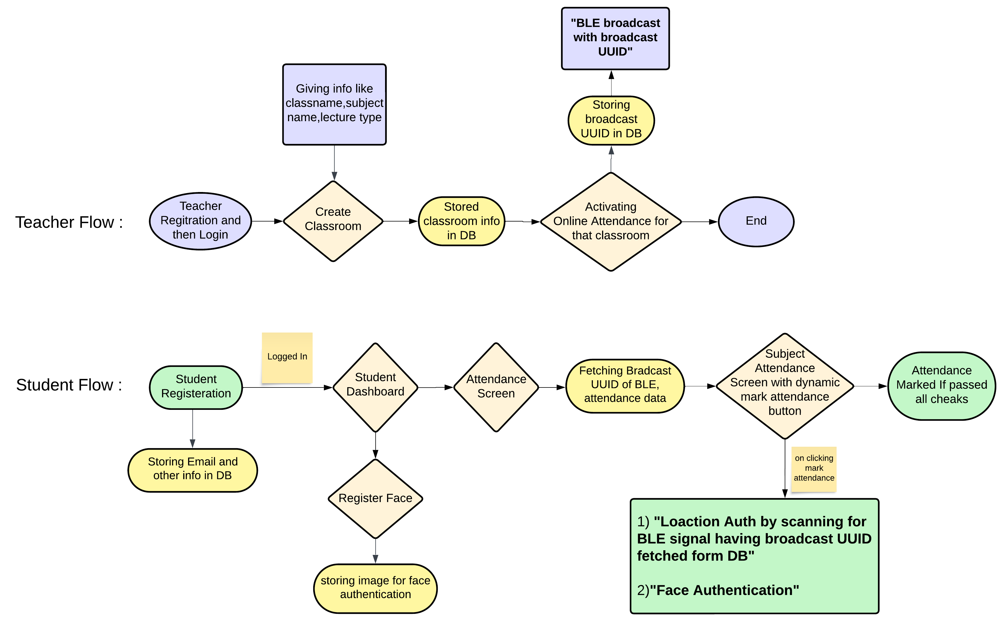
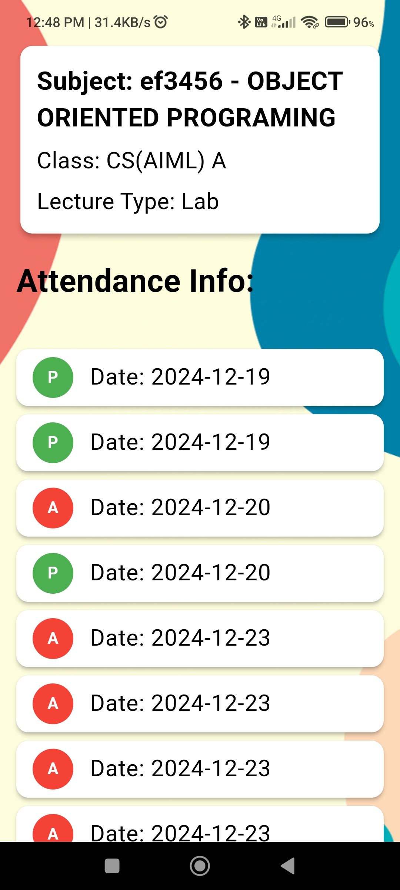
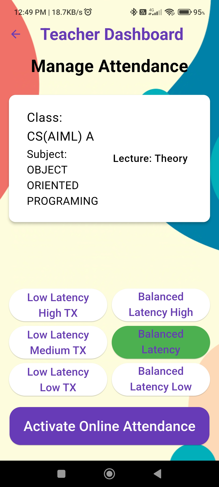

# **Smart Attendance System**

## **Overview**
The Smart Attendance System is a Flutter-based application that simplifies and secures the attendance process for educational institutions. By integrating **face recognition** and **BLE technology for location verification**, this system ensures accurate and fraud-free attendance management.

---

## **Key Features**
- **Student Dashboard:**
  - Face registration and authentication for secure attendance.
  - Attendance marking with real-time location verification using BLE signal detection.
- **Teacher Dashboard:**
  - Create classrooms with unique BLE signal identifiers for attendance sessions.
  - Manage and track attendance records.
- **Backend:**
  - Python-powered face recognition using the `face_recognition` library.
  - PHP scripts for secure database interactions.
- **Security:**
  - Multi-layer verification to prevent proxy attendance.
  - SQL injection prevention with prepared statements in PHP.

---

## **Tech Stack**
### **Frontend**
- Flutter
- `image_picker` plugin for image capture
- Platform-specific code for seamless Bluetooth signal detection and broadcasting

### **Backend**
- PHP for API and database interaction
- Python for face recognition
- Celery for asynchronous task management

### **Database**
- MySQL for storing user data, attendance records, and BLE UUIDs

### **Infrastructure**
- Apache web server
- Redis for Celery task queue

---

## **Flow Chart**
<div align="center">
  
</div>

---

## **How It Works**
### **Student Workflow**
1. Register with email and password.
2. Log in and register face for authentication.
3. Mark attendance:
   - Location check using BLE UUID detection.
   - Face verification via image capture and comparison.

### **Teacher Workflow**
1. Log in and create a classroom with details.
2. Start an online attendance session.
3. Monitor attendance records in real-time.

---

## **Screenshots**


### **Student Workflow** 


### 1. **Student Dashboard**
<!--  -->


### 2. **Attendance Dashboard**
<!--  -->


### 3. **Attendance Marking**
<!--  -->




---

### **Teacher Workflow** 

### 1. **Teacher Dashboard/ Create Classroom**
 

### 2. **Manage Online Attendance**


<!-- *(Add more screenshots as needed by saving images in your repository and linking them here.)* -->

---

## **Setup and Installation**
### **Prerequisites**
- Flutter installed on your system
- Python 3.9+ with required libraries (`face_recognition`, `dlib`, `numpy`, `celery`)
- MySQL Server
- PHP and a web server (Apache)
- Redis or RabbitMQ for Celery task management

### **Steps**
1. Clone the repository:
   ```bash
   git clone https://github.com/yourusername/smart-attendance-system.git

2. Navigate to the project directory:

   ```bash
   cd Flutter_Attendance/lib
   ```
3. Set up the backend:
   - Configure the PHP scripts in the `/lib/API` directory with your MySQL credentials. it also have `Schemas.txt` for database schemas.
   
   - Install Python dependencies:
      ```bash
      pip install -r requirements.txt
      ```
   - Start Redis on UBUNTU
      ```bash
      sudo service redis-server start
      ```
   - Start the Celery worker:
      ```bash
      celery  -A celery_tasks.tasks worker --loglevel=info -E
      ```
   - Start Apache server in it start MySQL, Apache 
4. Run the frontend:

    ```bash
    flutter pub get
    flutter run
    ```